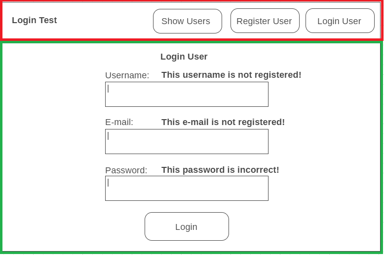

# MERN Stack: Login Assessment

In fulfilment of week 12 MERN assessment at QA consulting.

This project was bootstrapped with [Create React App](https://github.com/facebook/create-react-app).

## Index
[0. The Brief](#brief)
   
[1. Wireframes](#wireframes)
   
[2. Components](#components)

[3. Hierarchy](#hierarchy)

[4. Working Application](#browser)

[5. Next Steps](#next)

[6. Author](#auth)

[7. Acknowledgements](#ack)

# 0. The Brief

### Introduction

Build a React Application that models a User Login and Register System.  This system needs to show your knowledge of:
*	React
*	ReactStrap
*	Router
*	Snapshot testing

Your React application should make use of the provided Node Backend.

### Planning 

Plan out this application by:
1.	 Creating your wireframes.
2.	 Deciding on your components.
3.	 Deciding on a Component Hierarchy
4.	 Deciding where the state should be stored.

### User Stories:
#### User Story 1: 

As a user, I can register to the system by providing a valid username, valid email and verified password.

#### User Story 2: 

As a user, I want to then be able to login using this username and password.

#### User Story 3: 

As a user, I want to be able to see a list of the usernames of other users.

#### User Story 4: 

As a user, I want the system to inform me when I am trying to register with incorrect details.

#### User Story 5: 

As a user, I want to be informed when I am logging in with data that is inaccurate (hint: use the results from the post request to help you).

# 1. Wireframes

# 2. Components

# 3. Hierarchy

# 5. Working Application

This is determined in the routes to the mongo database and pushed to the front-end as jsons which are stringified and printed on screen if present (by updating the state of the component if errors received in the response).

As above: this is determined in the routes to the mongo database and pushed to the front-end as jsons which are stringified and printed on screen if present (by updating the state of the component if errors received in the response).

As above: this is determined in the routes to the mongo database and pushed to the front-end as jsons which are stringified and printed on screen if present (by updating the state of the component if errors received in the response).

As seen in the console log - passwords are not sent to the front end. The get all request removes them in the mongo database route endpoints. They are also hashed in the backend for extra security. Bcrypt is used to compare the provided password and hashed password when logging in.

# 5. Next Steps

Testing remains an issue.

The majority of the tests are successful, but due to an unresolved issue with asynchronicity the test results are not logged.

 

Also there remains an issue getting one of the tests to complete, which "Cannot read property 'map' of undefined".

This is a knowledge gap that is being bridged now.

# 6. Author

Rich Harris

# 7. Acknowledgements

* QA consulting and our fantastic instructors
* https://github.com/matt25969/node_user_login formed the base of my backend, which has been modified in order to fulfil the assessment requirements, hence the modified version is included in this repo in the UserLoginBackend folder.
